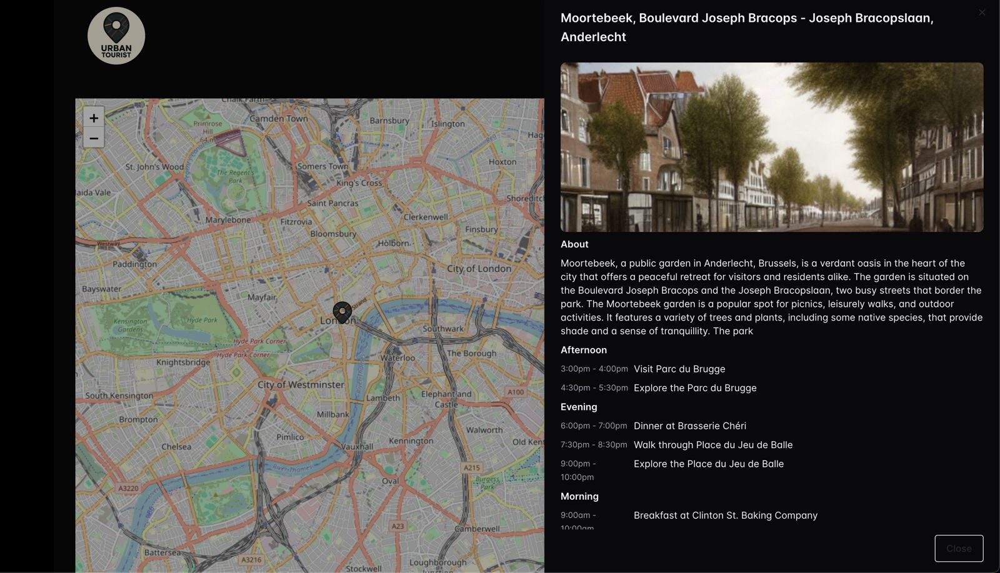
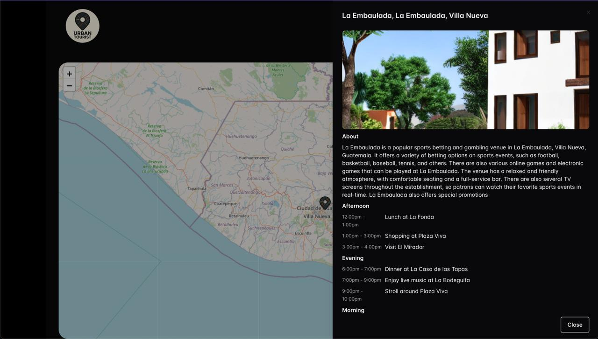

# AI Tourist Map
An AI-powered intelligent tourist map system that generates location information, personalized travel itineraries, location-based recommendations, and AI-generated images.
Unlike traditional maps (which only allow viewing information and pictures of fixed points of interest), AI Tourist Map enables clicking anywhere on the interactive map to:  
- Retrieve detailed information about that location  
- Generate a simulated local scene image using AI models   

The project integrates Flask backend + React frontend + AI models for text and image generation.  



  

# Installation
### 1. Clone Repository  
```bash
git clone https://github.com/WineGorilla/AI-Tourist-Map
cd AI-Tourist-Map
```

### 2. Backend Setup (Flask)  
```bash
cd Backend
pip install -r requirements.txt
# Replace with your own pyngrok token in main.py
python main.py
```

### 3. Frontend Setup (React)  
```bash
cd Frontend
# Replace the backend URL (Flask/Ngrok address) in the config file
npm install
npm start
```
  

# Tech Stack
- **Frontend**: React + TailwindCSS  
- **Backend**: Flask + Pyngrok  
- **Geocoding**: OpenStreetMap (Nominatim)  
- **Text Model**: OpenChat 3.5  
- **Image Model**: Stable Diffusion v1.5  
- **Deployment/Demo**: Google Colab + Ngrok  